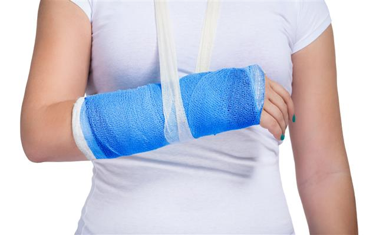

## REHABILITACJA ORTOPEDYCZNA I POURAZOWA

Celem rehabilitacji jest powrót do sprawności po przebytym urazie i unieruchomieniu, zabiegu ortopedycznym, operacji narządu ruchu, ale także przygotowanie pacjenta do planowanego zabiegu. Usprawnianie polega przede wszystkim na wyeliminowaniu bólu, poprawie ruchomości i stabilności oraz zwiększeniu siły mięśniowej.
Rehabilitacja ortopedyczna kierowana jest dla osób z problemami układu mięśniowo-szkieletowego takimi jak stany po:
– endoprotezoplastyce stawu biodrowego/kolanowego,
– artroskopiach,
– operacjach kręgosłupa,
– złamaniach, skręceniach, zwichnięciach

